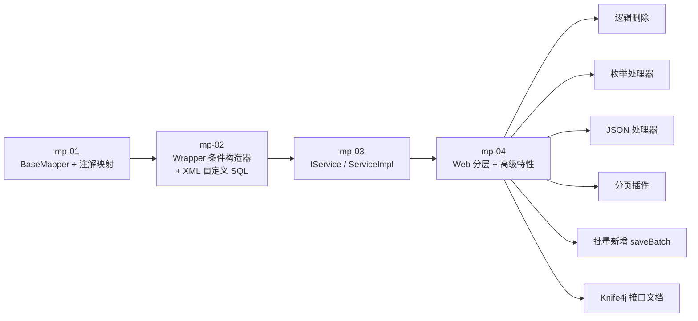
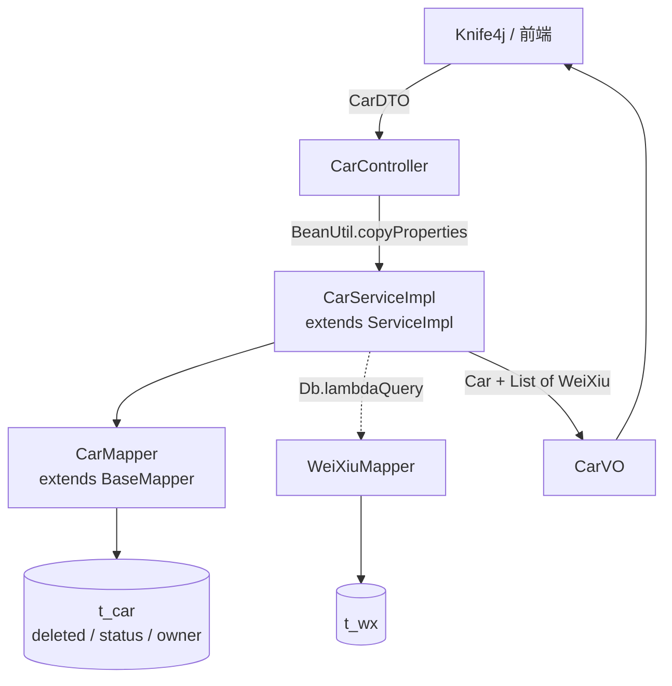

# MyBatis-Plus 学习示例

MyBatis-Plus（简称 MP）是 MyBatis 的增强工具，只做增强不做改变。本仓库按"单表 CRUD → 条件构造器 → IService → Web 业务接口 + 高级特性"的顺序拆成四个独立 Maven 模块，每个模块只引入该阶段需要的依赖和配置，配合根目录的 `MyBatis-Plus概述.md` 学习笔记一起阅读。

## 环境要求

版本取自各模块 `pom.xml`：

| 项 | 版本 |
| --- | --- |
| JDK | 21 |
| Spring Boot | 3.5.8（mp-01 ~ mp-03）／ 3.2.6（mp-04） |
| MyBatis-Plus | 3.5.17（`mybatis-plus-spring-boot3-starter`） |
| MyBatis-Plus 分页插件 | `mybatis-plus-jsqlparser` 3.5.17（仅 mp-04） |
| Knife4j | `knife4j-openapi3-jakarta-spring-boot-starter` 4.5.0（仅 mp-04） |
| Hutool | 5.8.42（仅 mp-04） |
| MySQL | 8.0+ |

mp-04 之所以把 Spring Boot 降到 3.2.6：Knife4j 4.5.0 自带的 springdoc-openapi 是 2.3.0，属于 Spring Boot 3.2 那一代的产品，`mp-04/pom.xml` 按这条适配线把父工程锁在 3.2.x。mp-01 ~ mp-03 不引 Knife4j，仍然是 3.5.8。

## 目录结构

```text
MyBatis-plus/
├── MyBatis-Plus概述.md          # 学习笔记：MP 的定位、注解、配置、Wrapper、IService、Db、逻辑删除、枚举/JSON 处理器、分页插件
├── sql/
│   └── mybatis-plus.sql          # Navicat 导出的建表脚本（t_car / t_customer / t_wx 三张表结构）
├── mp-01/                       # 第一个 MP 工程
├── mp-02/                       # 条件构造器 + 自定义 SQL
├── mp-03/                       # IService / ServiceImpl
└── mp-04/                       # Web 分层 + MP 高级特性
```

## 模块导航

| 模块 | 主题 | 关键代码 |
| --- | --- | --- |
| mp-01 | BaseMapper 的单表 CRUD；实体类与表的映射关系 | `entity/Car.java`（`@TableName`/`@TableId` 主键策略注释）、`entity/Customer.java`（属性名与字段名不一致、`isVip`、关键字 `desc`、`exist = false` 四种映射场景）、`Mp01ApplicationTests`（增删改查） |
| mp-02 | 条件构造器 Wrapper 系列；把 SQL 片段放回 XML | `Mp02ApplicationTests`（QueryWrapper / LambdaQueryWrapper / UpdateWrapper / LambdaUpdateWrapper、`setSql`）、`mapper/CarMapper.xml`（`${ew.customSqlSegment}`）、`ReflectTest`（方法引用 → `SerializedLambda` → 字段名，解释 Lambda 查询的原理） |
| mp-03 | IService / ServiceImpl，业务层不再手写 Wrapper | `service/CarService`、`service/Impl/CarServiceImpl`、`Mp02ApplicationTests`（mp-03 的测试类沿用了 mp-02 的文件名；`carService.lambdaQuery().eq(...).one()`） |
| mp-04 | Controller + DTO/VO 分层，以及逻辑删除、枚举处理器、JSON 处理器、分页插件、批量新增 | `controller/CarController`、`dto/CarDTO`、`vo/CarVO`、`common/CarStatus`、`config/MyBatisConfig`、`config/Knife4jConfig`、`entity/Owner` + `JacksonTypeHandler`、`Mp04ApplicationTests`（`save`/`saveBatch` 对比、分页、JSON 车主） |

## 数据准备

1. 先建库，再导入表结构。`sql/mybatis-plus.sql` 是 Navicat 从 `mybatis-plus` 库导出的结构脚本，里面没有 `CREATE DATABASE` 和 `USE` 语句，所以库要自己建；脚本带有 `DROP TABLE`，执行会重建这三张表，已有数据会丢失：

   ```bash
   mysql -uroot -p -e "create database if not exists mybatis-plus default character set utf8mb4 collate utf8mb4_general_ci;"
   mysql -uroot -p mybatis-plus < sql/mybatis-plus.sql
   ```

   导入后的表结构（含 `owner` 的 JSON 类型、`deleted`/`status` 默认值）已在 MySQL 8.0.39 上用独立临时库验证可正常执行。

2. 脚本只建表不含数据，测试数据由各模块自己写入：mp-01 的 `testInsert` / `testInsertCustomer` 写入单条记录，mp-04 的 `testSave`、`testSaveBatch` 循环造 1000 条。mp-02 的条件构造器测试依赖表里存在 `brand` 以"宝"开头、尤其是等于"宝马"的记录，跑测试前先确认 `t_car` 里有这类数据。

3. 四个模块的 `application.yaml` 默认连接 `jdbc:mysql://localhost:3306/mybatis-plus`、账号 `root`、密码 `123456`，按自己本机情况修改。mp-04 的 URL 上多了 `rewriteBatchedStatements=true`，这是 `saveBatch` 把多条 insert 合并成一条的前提。

4. mp-01 ~ mp-04 共用同一个 `mybatis-plus` 库和同一套表，不需要为每个模块单独建库。`t_car` 上的 `deleted`/`status`/`owner` 三个字段只被 mp-04 的实体类声明，前三个模块生成的 SQL 不涉及它们。

## 数据库设计

### t_car 汽车信息

除 `id` 外，其余字段都允许为 NULL。

| 字段 | 类型 | 说明 |
| --- | --- | --- |
| id | BIGINT AUTO_INCREMENT | 主键，`IdType.AUTO` |
| car_num | VARCHAR(255) | 车牌号 |
| brand | VARCHAR(255) | 品牌 |
| guide_price | DECIMAL(10,2) | 厂商指导价（万元） |
| produce_time | CHAR(10) | 出厂日期，实体类用 `String` 接收 |
| car_type | VARCHAR(255) | 汽车类型：燃油车 / 电车 / 氢能源；降价到 10 万及以下时 mp-04 会改写为"低端车" |
| deleted | INT DEFAULT 0 | 逻辑删除标记，1 已删除 / 0 未删除（mp-04） |
| status | INT DEFAULT 1 | 1 在售 / 2 已售 / 3 维修中 / 4 报废（mp-04 枚举处理器） |
| owner | JSON | 车主信息，由 `JacksonTypeHandler` 读写（mp-04 JSON 处理器） |

### t_customer 客户信息（mp-01）

| 字段 | 类型 | 对应实体类属性 | 映射要点 |
| --- | --- | --- | --- |
| id | BIGINT AUTO_INCREMENT | `Long id` | `@TableId(value = "id", type = IdType.AUTO)` |
| username | VARCHAR(255) | `String name` | 名称不一致，需要 `@TableField("username")` |
| is_vip | VARCHAR(255) | `Boolean isVip` | MP 3.4.0 以上可自动对应；列是 varchar，`true` 落库为 `'1'` |
| desc | VARCHAR(255) | `String desc` | 数据库关键字，@TableField 的注解值需要用反引号包裹列名 |
| —— | 无对应字段 | `LocalDateTime createTime` | `@TableField(exist = false)` |

### t_wx 维修记录（mp-04）

`id` BIGINT AUTO_INCREMENT / `time` CHAR(10)（@TableField 的注解值用反引号包裹列名）/ `cost` DECIMAL(10,0) / `description` VARCHAR(255) / `car_id` BIGINT。`car_id` 是逻辑外键，指向 `t_car.id`，两表之间没有建物理外键，关联由业务代码维护。

以上字段类型与 `sql/mybatis-plus.sql` 中的建表语句一致，该脚本由本机 MySQL 8.0.39 的 `mybatis-plus` 库导出。

## mp-04 接口清单

运行 `Mp04Application`（端口 8080），打开 `http://localhost:8080/doc.html` 查看 Knife4j 文档。

`mp-04` 已在本机实测：`mvn spring-boot:run` 可正常启动，`/doc.html`、`/v3/api-docs`、`/api/cars/{id}`、`/api/cars/conditions` 均返回 200，`status` 输出中文枚举值、`owner` 由 JSON 处理器还原成对象。端口 8080 若已被占用（例如 IDEA 里已有一个实例），启动会停在 `Port 8080 was already in use`，需要先结束旧实例或加 `-Dserver.port=8081`，这与 Knife4j 无关。

| 方法 | 路径 | 说明 |
| --- | --- | --- |
| POST | `/api/cars` | 新增汽车，请求体 `CarDTO`；`status` 传枚举中文名（如 `在售`） |
| DELETE | `/api/cars/{id}` | 逻辑删除，生成 `update t_car set deleted = 1 where id = ?` |
| GET | `/api/cars/{id}` | 汽车详情，返回 `CarVO`，含 `weixiuVOList` 维修记录 |
| GET | `/api/cars?ids=1,2,3` | 按 ID 集合批量查询 |
| PUT | `/api/cars/{id}/reduction/{price}` | 降价（万元），带并发校验 |
| GET | `/api/cars/conditions` | 多条件查询：`brand`（模糊）、`carType`、`minPrice`、`maxPrice` |

## 思路图

学习路径：



mp-04 的分层与数据流：



## 各特性的落地位置

- **主键策略**：`application.yaml` 的 `global-config.db-config.id-type: auto`，实体类再标注 `@TableId`；mp-01 的 `Car.java` 注释里对比了 AUTO / ASSIGN_ID / ASSIGN_UUID / INPUT / NONE。
- **更新策略**：`update-strategy: not_null`，属性为 null 时不进入 set 子句。
- **二级缓存开关**：mp-01 配 `cache-enabled: false`，mp-02/03/04 配 `true`（该配置对应 MyBatis 的 `cacheEnabled`，管理的是二级缓存；一级缓存由 `localCacheScope` 控制，本工程未做配置）。
- **逻辑删除**：mp-04 全局配置 `logic-delete-field: deleted` + 删除值 1 / 未删除值 0，`Car` 实体声明了 `deleted` 属性所以生效；`WeiXiu` 实体没有该属性，MP 不会为 `t_wx` 生成逻辑删除条件。
- **枚举处理器**：`default-enum-type-handler: MybatisEnumTypeHandler`，`CarStatus` 用 `@EnumValue` 决定落库存 `value`（1~4），用 `@JsonValue` 决定 JSON 用中文 `desc`。
- **JSON 处理器**：`@TableName(autoResultMap = true)` + `@TableField(typeHandler = JacksonTypeHandler.class)`，把 `Owner` 对象读写为 `owner` 列的 JSON 字符串。
- **分页**：`MyBatisConfig` 注册 `PaginationInnerInterceptor(DbType.MYSQL)` 并设 `maxLimit = 500`，`Page` 对象通过 `addOrder(OrderItem.desc/asc)` 排序，结果自动装进 `pages` / `total` / `records`。
- **批量新增**：`save` 循环与 `saveBatch` 两个测试对照，配合 URL 上的 `rewriteBatchedStatements=true`。
- **降价的并发保护**：`lambdaUpdate().set(价格).eq(id).eq(Car::getGuidePrice, 查出来的原价)`，更新影响 0 行即判定为并发冲突并抛异常；降价后价格 ≤ 10 万时用动态 `set` 把 `car_type` 改为 `低端车`。

## 数据与署名说明

- 代码和学习笔记中出现的姓名（张三、李四、王五、赵六）、车牌号、邮箱都是虚拟示例值，不对应任何真实人物或车辆；`sql/mybatis-plus.sql` 只包含表结构，没有数据。
- `MyBatis-Plus概述.md` 中的 Knife4j 配置片段使用虚拟署名（`张三` / `zhangsan@example.com`）；mp-04 的 `config/Knife4jConfig.java` 保留本仓库作者的署名 `老汤` / `ittxf@126.com`，这一处文档与代码取值不同。
- 学习笔记里的代码片段包名为 `com.jkweilai.mp.*`，本工程实际包名为 `com.ittxf.mp.*`，抄写片段时需替换。

## 总结

四个模块沿着 MP 的使用层次递进：mp-01 用 `BaseMapper` 的 `insert/deleteById/updateById/selectById/selectList` 跑通单表 CRUD，并借 `t_customer` 把 `@TableName`、`@TableId`、`@TableField` 的四种映射场景固定下来；mp-02 把查询条件从硬编码字符串迁移到 `QueryWrapper` / `LambdaQueryWrapper`，用 `UpdateWrapper.setSql` 处理定制 set 子句，再把带 `set` 的更新放回 XML 用 `${ew.customSqlSegment}` 承接，`ReflectTest` 则从方法引用反解出字段名，说明 Lambda 写法的底层依据；mp-03 引入 `IService` / `ServiceImpl`，业务层通过 `lambdaQuery()`、`lambdaUpdate()` 直接构造条件，不再手动 new Wrapper；mp-04 补齐 Controller + DTO + VO 的 Web 分层和 Knife4j 文档，并把逻辑删除、枚举处理器、JSON 处理器、分页插件、批量新增这些实际项目里会遇到的能力逐一落到 `t_car` / `t_wx` 上。`sql/mybatis-plus.sql` 是从本机 `mybatis-plus` 库导出的建表脚本，字段类型与各模块的实体类一一对应，并在 MySQL 8.0.39 的独立临时库上执行验证通过；脚本不含数据，克隆仓库后按"数据准备"一节建库导表、改连接配置，再由各模块的测试写入数据即可复现场景。
